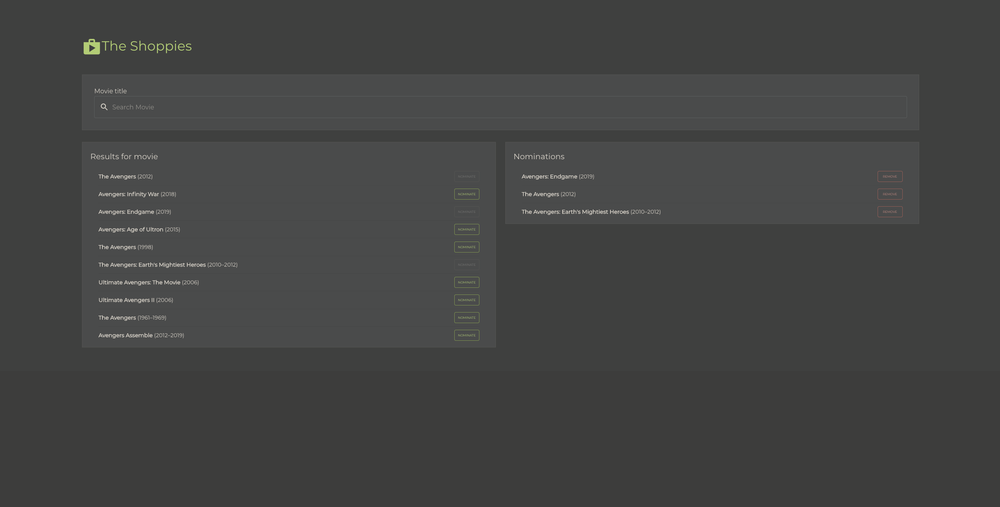
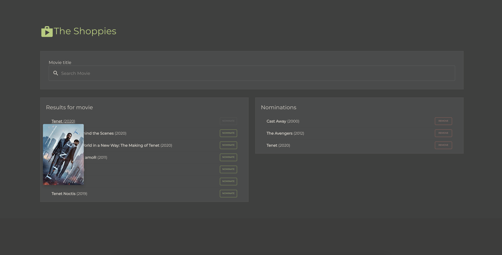
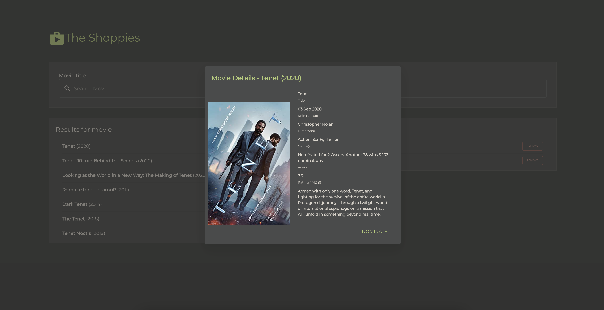

<h1 align="center">
The Shoppies
<br />
Movie nominations
</h1>



<p align="center"><sup><i>Home page</i></sup></p>

The Shoppies is my submission for the Shopify Frontend Developer Internship challenge for Fall 2021.
Check it out at [https://shopify-challenge-fall-2021.web.app/](https://shopify-challenge-fall-2021.web.app/).

## The Challenge

The main objectives were to complete the following.

> We need a webpage that can search OMDB for movies, and allow the user to save their favourite films they feel should be up for nomination. When they've selected 5 nominees they should be notified they're finished.
>
> We'd like a simple to use interface that makes it easy to:
> - Search OMDB and display the results (movies only)
> - Add a movie from the search results to our nomination list
> - View the list of films already nominated
> - Remove a nominee from the nomination list
>
> **Technical requirements**
>
> 1. Search results should come from OMDB's API (free API key: http://www.omdbapi.com/apikey.aspx).
> 2. Each search result should list at least its title, year of release and a button to nominate that film.
> 3. Updates to the search terms should update the result list
> 4. Movies in search results can be added and removed from the nomination list.
> 5. If a search result has already been nominated, disable its nominate button.
> 6. Display a banner when the user has 5 nominations.

In addition to these requirements, the following features we're implemented:
- Saving nomination lists to their local storage implemented so users can keep their data if they leave the page.
- Animations for loading, adding/deleting movies and notifications when there occurs and error

## Hosting

The project is hosted on [Firebase Hosting](https://firebase.google.com/products/hosting/) at [https://shopify-challenge-fall-2021.web.app/](https://shopify-challenge-fall-2021.web.app/).

## Preview

Please visit [https://shopify-challenge-fall-2021.web.app/](https://shopify-challenge-fall-2021.web.app/) or see the [docs/images/](docs/images/) folder for screenshots.



<p align="center"><sup><i>Hover over movie</i></sup></p>



<p align="center"><sup><i>Dialog page screenshot</i></sup></p>

## Technologies Used

- TypeScript
- Material-UI
- Firebase Hosting
- Nightwatch.js

## Testing

The following tests were run using the Nighwatch end-to-end testing framework:
- Inputting invalid movie.
- Nominating more than 5 movies.
- Removing a movie.
- Nominating followed by removing a movie.
- Saving data to local storage
- Saving data to local storage followed by removing nominated movies
- Saving data to local storage followed by keeping nominated movies

## Getting Started

Clone this repo and run `npm install` while in the repo root directory to install project dependencies.

There are three commands available:

```

# create a production build:
npm run build

# start a production server on port 3000:
npm start

# run nightwatch tests
npm run test

```
